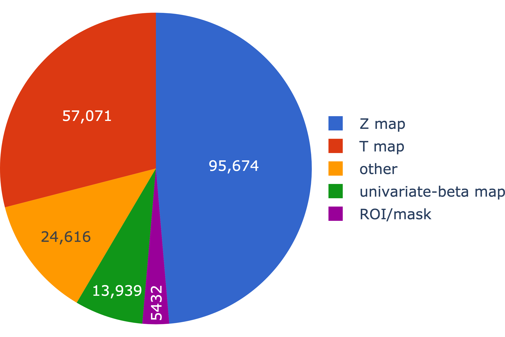
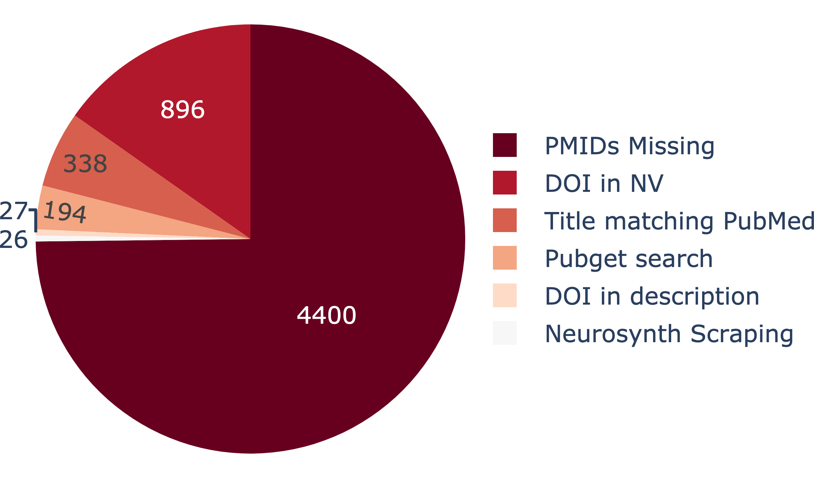

by Alejandro de la Vega

*Special thanks to Julio Peraza, Kendra Oudyk and Ross Blair for data retrieval and analysis for this post.*

---

##### 🚨 **We need your help!** 🚨

##### We want to learn why people use NeuroVault, and how to improve it to incentivize data sharing and re-use. 
##### *Take a few minutes to tell us what the future of NeuroVault should look like!*

    
    
    <a class="survey-button" target="_blank" href="https://tally.so/r/wLP2Oj">Take the NeuroVault survey 🗳️</a>

---

It's hard to believe, but it's been over 10 years since NeuroVault was first launched. 🎉

In 2013, at the [Neurosynth Hackathon](https://web.archive.org/web/20131202224713/http://hackathon.neurosynth.org/) in Boulder, Colorado, Chris Gorgolewski furiously typed away at his laptop, and three days later with the help of lots of coffee and Tal Yarkoni's ever watchful gaze, NeuroVault was born! 

The mission was simple: to provide a place where researchers can publicly store and share unthresholded statistical maps, parcellations, and atlases produced by MRI and PET studies. 

*The reason?*  Neuroimaging studies are expensive, but they're often underpowered, and statistical results are summarized into figures and thresholded peak coordinates, *discarding valuable information*. Although neuroimaging has advanced significantly since 2013--with notably larger *and* deeper samples becoming more common-- the core mission to enable public sharing of neuroimaging results remains relevant as ever.

As an attendee of that hackathon in Boulder (in fact, it was my very first one!), I'm happy to say that nearly 11 years later, **NeuroVault is very much alive and well**. NeuroVault is visited by *nearly 30,000 users a year*, and boasts a *staggering 269,934 images* contributed by 3,216 unique users!

I want to take some time to dive into this wealth of data, to understand the state of NeuroVault a decade later, and ask **in what ways NeuroVault has succeeded**, and **how we can improve the platform** to help ensure the next decade of neuroimaging data sharing is even more successful.

Let's dive in! 📊

### What has been uploaded to NeuroVault?

The [oldest collection](https://neurovault.org/collections/2/) dates from June 6th, 2013 and belongs to "Escaping the here and now: Evidence for a role of the default mode network in perceptually decoupled thought" by [Smallwood et al. (2013)](https://www.sciencedirect.com/science/article/abs/pii/S1053811912011895?via%3Dihub).

Since then the number of collections uploaded to NeuroVault has steadily increased, reaching a peak in 2023 with 778 collections uploaded. 

Note that although only 15% of collections of are associated with a published article DOI, this figure is dragged by the time it takes to publish articles, and incomplete meta-data. I'll come back to this point.

#### Images

The number of images uploaded per year varies much more, reaching a peak in 2021 with 60,441 images! A majority of images are annotated using the [Cognitive Atlas](cognitiveatlas.org) Ontology, for both Task and Contrast IDs, providing critical meta-data for subsequent re-use.

Unsurprisingly, the vast majority of images on NeuroVault are "fMRI-BOLD", with other modalities comprising a small minority. 
In keeping with the spirit of NeuroVault, around 3/4 of the uploaded images are unthresholded, meaning the full richness of the data is maintained. Similarly, over 3/4 of images in NeuroVault are statistical maps (Z or T), with other types of images, such as variance and effect maps, making up a smaller proportion1.

Somewhat surprisingly, 88% of images in NeuroVault are from individual subjects, with only 10% of images corresponding to group-level maps. 
This is driven by a few very large collections, however. 

Looking at the 2,240 collections associated with a DOI and sufficient meta-data, 1844 group-level data while only 190 collections have single-subject data.

Speaking of large collections, the award for largest published collection goes to ["Brain topography beyond parcellations: Local gradients of functional maps"](https://neurovault.org/collections/16103/) by Dohmatob et al. (2021). This collection features a staggering 29,464 images. Impressive! 🏆

### Increasing NeuroVault adoption

At this point, you might be under the impression that NeuroVault is unequivocal success. However, it's important to ask: *how common is it for researchers to upload their data to NeuroVault?*

Using a representative sample of neuroimaging articles from PubMed Central2 (fetching using [pubget](https://github.com/neuroquery/pubget]) ), we find that although the proportion of studies using NeuroVault to share their data has increased year to year, **a large proportion of studies continue to only report peak coordinates in a table**!

Help us continue to increase NeuroVault usage by sharing with your colleagues, and taking a few minutes to share your ideas on how to incentivize use in [our survey](https://tally.so/forms/wLP2Oj). 

### Understanding the contents of NeuroVault studies

To truly understand what types of studies are uploaded to NeuroVault, it helps to link collections to their corresponding published articles. 

However, many articles are ultimately never linked to publications, in part because users often upload their data *prior to peer review*. This means one must remember to go back and associate their collection with the final publication.

Indeed, the average time between when a collection is created and finally linked with a DOI is **154 days**, with some collections *taking over 4 years to get a DOI!* 

By searching the published literature, however, we can infer the most likely article to be associated with a collection. Using a few related methods, we were able to link several hundred more collections, increasing the number of collections with a DOI to nearly 1,500! 

This is likely an underestimate, but suggests that an encouraging number of NeuroVault collections go on to be published. 

### Is NeuroVault data representative of the literature?

Now we can ask: **what cognitive concepts are represented in NeuroVault?**

Looking at the most commonly used words in articles in NeuroVault, we can see that a wide variety of topics are covered, with **working memory** being the most commonly studied subject.

But, *is this representative of the literature at large?*

To answer this question, we can compare the distribution of topics derived using a representative sample of the fMRI literature (~10k studies from PubMed Central), to the distribution of those same topics using only articles linked to NeuroVault collections.

This reveals that, **many popular topics from the general literature are under-represented in NeuroVault**.

Notably, many clinical topics (e.g. "depression", "epilepsy", "anxiety", "ms", "pain") are much less common in NeuroVault. This indicates *we can do a better job as basic science researchers in reaching out to clinical researchers*, encouraging them to contribute valuable data to open access repositories such as NeuroVault.

### Is NeuroVault data *re-used*?

A core goal of NeuroVault is to *enable the re-use of uploaded data* in downstream meta-scientific use cases, such as large-scale image-based meta-analysis and ROI creation. **Have we achieved this goal?**

To answer this, we looked at a representative sample of published neuroimaging studies and identified NeuroVault collections which were mentioned at more than *once* as a measure of post-publication re-use.

By this measure, **a respectable ~23% of collections with a DOI were mentioned more than once!**, with the majority being atlases.

The most re-used collection is the [Harvard-Oxford cortical and sub-cortical atlas](https://neurovault.org/collections/262/), re-used 8 times, followed by ["Degrees of lateralisation in semantic cognition: Evidence from intrinsic connectivity"](https://neurovault.org/collections/4683/) with 6 re-uses. Well-done! 👏

However, it's clear that there is much more potential for re-use. For example, although NeuroVault has [built in capacity for image-based meta-analysis](https://neurovault.org/my_metaanalyses/new) it's seldom used, due to the difficulties in finding relevant images. 

If you're interested in performing an image-based meta-analysis, let me make a shameless plug for [NeuroSynth Compose](compose.neurosynth.org), the latest iteration of our open platform for large-scale meta-analysis. We are actively working on a web-based interface for image-based meta-analysis using NeuroVault data, which we hope to release in the coming months!

ℹ️ We have also created an easily accessible *NeuroVault data archive* [accessible on Github](https://github.com/NeuroVault/nv-data/).
It currently features data from November 2022, but we'll be updating it soon with the latest data.

## You turn: help guide the future of NeuroVault! 🚀

NeuroVault has gained remarkable traction in the neuroimaging field, and continues to be used to this date, spanning an impressive amount of neuroimaging statistical maps.

But, as I hope you appreciate now, there is much work to be done to increase NeuroVault adoption and the re-use of this valuable data.

Let's make sure the next decade of open neuroimaging data sharing is even more successful than the last!

To help, please share your thoughts with us in our survey. And, don't hesitate to get in contact to share your ideas, or if you need help accessing these data.

    
    
    <a class="survey-button" target="_blank" href="https://tally.so/r/wLP2Oj">Take the NeuroVault survey!rt</a>

#### Footnotes
1 2,568/24,616 images corresponding to infrequent categories such as p-map, f-map, multivariate-beta map and parcellation were excluded for visualization

2 fmri[Title/Abstract] OR functional MRI[Title/Abstract] OR functional magnetic resonance imaging [Title/Abstract] AND human