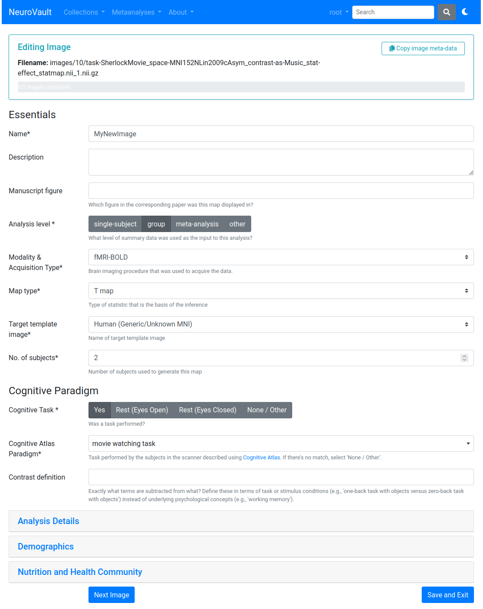

by Alejandro de la Vega

*Special thanks to Ross Blair and James Kent for making these updates possible.*

---

In our [previous post](https://neurovault.github.io/updates/2024/03/07/decade.html), we asked for your help shaping NeuroVault. Thanks to everyone who filled out the survey!  

Based on your input, we completed a one-week mini-hackathon at UT Austin in January. Our focus: make NeuroVault more user-friendly, improve image uploading, and boost findability for the thousands of existing collections. Below is a high-level summary of what’s new and improved.

## Streamlined Image Upload & Editing

We heard from many of you that the image uploading process could be more intuitive (to put it nicely). To address this, we’ve streamlined the image upload and metadata editing process:

- **Overhauled Metadata Flow**  
  We cleaned up and reorganized the edit image page, highlighting essential fields first and hiding niche fields (e.g. demographics, nutrition) by default.

- **Created Bulk Editing Wizard**  
  When you upload multiple images, you’ll now move through a linear step-by-step editor—complete with a progress bar—ensuring no fields or images get overlooked.

- **Reduced manual retyping of Metadata**  
  If you’re uploading many images from a similar study, you can now copy previously entered info to speed things up. This is very useful if you're uploading multiple images corresponding to the same contrast (e.g., t and effect maps), or if the task metadata is shared across different contrasts.

- **Easier Task Annotation**  
  Selecting tasks from the Cognitive Atlas is now more straightforward, and we now offer quick choices like “None/Other” or “Rest-Eyes Open" so you don't have to search the entire list for these common options.

## Easier Collection Creation

Creating a new collection is now more straightforward and encourages annotation of key metadata fields:

- **Simplified Forms**  
  We trimmed down the “Edit Collection” page to be visually cleaner—highlighting what's most important—and only show relevant fields (e.g., registration details appear only if you confirm registration was done).

- **Publication Intent Required for Long-Term Archival**  
  NeuroVault is a general-purpose repository, but its primary focus is archiving statistical maps from studies intended for publication.  
  - We now explicitly ask if your collection is bound for publication (submitted or published).  
  - To facilitate future data re-use, we encourage you to provide a DOI from a publication or preprint.  
  - For long-term archival, you must include a preprint or published DOI; otherwise, your collection may not be permanently stored.

## Advanced Search Features

Searching and re-using data in NeuroVault can be challenging. We introduced new filters to help you find exactly what you need. You can now filter collections by:

- **DOI**  
- **Modality**  
- **Task**

We also added a **Last Modified** column, so you can easily spot recent changes. Empty collections are now hidden from the public view to keep searches tidy. 

Finally, you can switch between **Dark Mode** and **Light Mode**—addressing a personal pet peeve!

---

## We Need Your Feedback!

NeuroVault is not currently supported by dedicated funding, so community input and contributions are vital. Let us know if these changes are helpful (or if you spot any issues) via [GitHub Issues](https://github.com/NeuroVault/NeuroVault/issues), or email us directly.

Looking into the future, we’re exploring bigger updates and new funding opportunities to expand NeuroVault’s role as a key community resource. In the meantime, **stay tuned for upcoming image-based meta-analysis features in [Neurosynth Compose](compose.neurosynth.org) this year**!

Thank you for your continued support—NeuroVault is shaped by the neuroimaging community.

**– Alejandro de la Vega, on behalf of the NeuroVault Team**  
